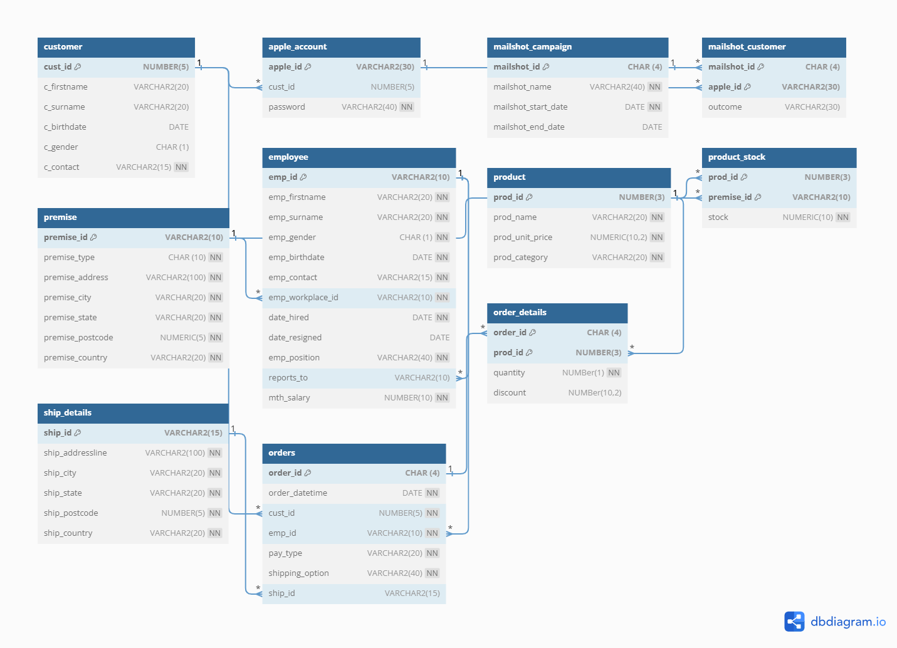

# Database Design and Optimization Project: Apple Inc.

## Table of Contents

1. [Company’s Description](#1-companys-description)
2. [Problem Statement](#2-problem-statement)
3. [Business Requirements](#3-business-requirements)
   1. [Core Objectives](#31-core-objectives)
   2. [Key Tables](#32-key-tables)
   3. [Additional Considerations](#33-additional-considerations)
4. [Business Rules](#4-business-rules)
5. [Constraints](#5-constraints)
6. [Relationships](#6-relationships)
7. [Completed Database Design Process](#completed-database-design-process)

## 1. Company’s Description

Apple Inc. is an American multinational technology company founded in the 1970s by Steven Jobs. It specializes in designing, developing, and selling consumer electronics, software, personal computers, smartphones, tablets, and online services. Apple's mission is to provide the best personal computing products and support globally.

## 2. Problem Statement

Increased demand for Apple products during the COVID-19 pandemic has led to performance issues in the company's database. This includes real-time update delays, data redundancies, anomalies, and inconsistencies. To address this, a database redesign is necessary for improved operational performance.

## 3. Business Requirements

### 3.1 Core Objectives

- Track customers (in-store & online)
- Monitor inventory levels
- Manage orders
- Handle premises
- Track mailshot campaigns
- Maintain employee information

### 3.2 Key Tables

1. **Customer Table:**
   - Fields: Customer ID, First Name, Surname, Date of Birth, Gender, Contact Number

2. **Apple Account Table:**
   - Fields: Apple ID (unique), Customer ID, Password

3. **Product Table:**
   - Fields: Product ID, Name, Price per Unit, Product Category

4. **Order Table:**
   - Fields: Order ID, Order Date and Time, Customer ID, Product ID, Employee ID, Payment Type, Shipping Option

5. **Shipping Details Table:**
   - Fields: Ship ID, Shipping Address, City, State, Postcode, Country

6. **Premise Table:**
   - Fields: Premise ID, Premise Type, Premise Address

7. **Employee Table:**
   - Fields: Employee ID, Name, Gender, Date of Birth, Contact, Premise ID, Date Hired, Date Resigned, Position, Person to Report to, Monthly Salary

8. **Product Stock Table:**
   - Fields: Product ID, Premise ID, Quantity

9. **Mailshot Campaign Table:**
   - Fields: Mailshot ID, Mailshot Name, Start Date, End Date

### 3.3 Additional Considerations

- Handle in-store and online purchases
- Record various payment methods and shipping details for orders
- Track employee details, including reporting relationships and positions
- Manage product stock in different premises
- Track mailshot campaigns

## 4. Business Rules

1. Each customer may own zero or many Apple accounts.
2. Each Apple account is owned by only one customer.
3. Each Apple account is associated with zero or many mailshot campaigns.
4. Each mailshot campaign is associated with many Apple accounts.
5. Each customer may make zero or many orders.
6. Every order is made by only one customer.
7. Every order must be associated with at least one valid product.
8. Each product may be associated with zero or many orders.
9. Each product may be found in one or many premises.
10. Each premise may have zero or many products.
11. Each premise employs one or many employees.
12. Each employee works at one premise.
13. Each employee reports to zero or one employee.
14. Each employee manages zero or many employees.
15. Each employee processes zero or many orders.
16. Each order is processed by an employee.
17. Each order may have zero or one shipping details.
18. Each shipping detail is associated with one order.

## 5. Constraints

1. Customer gender type can be either ‘F’ or ‘M’ only.
2. Premise type must be either office, state, or warehouse.
3. Employee gender type can be either F or M only.
4. Payment type is either cash, check, credit card, debit card, or online banking.
5. Shipping options are in-store purchase, delivery service, or in-store pickup.
6. Product ID must be between 100 and 200.

## 6. Relationships

- Customers to Apple accounts (one to many)
- Apple accounts to orders (one to many)
- Orders to product (Many to many)
- Employee to orders (one to many)
- Employee to premises (Many to one)
- Products to premises (many to many)
- Orders to shipping details (one to one)
- Apple account to mailshot campaign (many to many)
- Product stock to premises (many to one)

## 7. Completed Database Design Process

Throughout the database design process, I systematically progressed through phases, from understanding requirements to the physical implementation. The flowchart illustrates the steps undertaken to design the Apple Inc. database, ensuring it meets business needs and maintains data integrity and consistency.

### Phase I: Requirements Collection and Analysis

**Database Name:** AppleIncDB

**Data Requirements**

1. **Customers**
   - Attributes: First Name, Surname, Gender, Contact Number
   - Primary Key: Customer ID

2. **Apple Account**
   - Attributes: Apple ID (Primary Key), Email Address (Unique), Customer ID (Foreign Key), Password

3. **Product**
   - Attributes: Product ID (Primary Key), Name, Price, Category

4. **Order**
   - Attributes: Order ID (Primary Key), Order Date and Time, Customer ID (Foreign Key), Product ID (Foreign Key), Employee ID (Foreign Key), Payment Type, Shipping Option, Ship ID (Optional, Foreign Key)

5. **Employee**
   - Attributes: Employee ID (Primary Key), Name, Gender, Date of Birth, Contact, Premise ID (Foreign Key), Date Hired, Date Resigned, Position, Person to Report To (Foreign Key - Recursive), Monthly Salary

6. **Premise**
   - Attributes: Premise ID (Primary Key), Type (Office, Warehouse, Store), Address

7. **Shipping Details**
   - Attributes: Ship ID (Primary Key), Shipping Address, City, State, Postcode, Country

8. **Mailshot Campaign**
   - Attributes: Mailshot ID (Primary Key), Mailshot Name, Start Date, End Date, Outcome (No Response, Order Obtained)

9. **Product Stock**
   - Attributes: Stock ID (Primary Key), Product ID (Foreign Key), Premise ID (Foreign Key), Quantity

**Check Constraints**

1. Customer gender type can be either 'F' or 'M' only.
2. Premise type must be either office, state, or warehouse.
3. Employee gender type can be either F or M only.
4. Payment type is either cash, check, credit card, debit card, or online banking.
5. Shipping options are in-store purchase, delivery service, or in-store pickup.
6. Product ID must be between 100 and 200.

### Phase II
**Conceptual Design**

**Entity-Relationship Diagram**


### Phase III: Logical Design (Data Model Mapping)

**Logical Schema**
The logical design phase involves transforming the Entity-Relationship (E-R) diagram into a concrete representation known as the logical database schema. In this schema, entities, relationships, attributes, primary keys, and foreign keys are precisely defined to provide a blueprint for creating the database tables.

### Entities:

1. **Customer**
2. **Apple Account**
3. **Mailshot Campaign**
4. **Mailshot Customer**
5. **Premise**
6. **Employee**
7. **Product**
8. **Product Stock**
9. **Ship Details**
10. **Orders**
11. **Order Details**

### Relationships:

1. **Customer - Apple Account**
   - Relationship: One-to-One
   - Foreign Key: `cust_id` in Apple Account references `cust_id` in Customer.

2. **Mailshot Campaign - Mailshot Customer**
   - Relationship: One-to-Many
   - Foreign Keys: 
      - `mailshot_id` in Mailshot Customer references `mailshot_id` in Mailshot Campaign
      - `apple_id` in Mailshot Customer references `apple_id` in Apple Account

3. **Employee - Employee (Self-Reference)**
   - Relationship: Hierarchical (Reports To)
   - Foreign Key: `reports_to` in Employee references `emp_id` in Employee.

4. **Employee - Premise**
   - Relationship: Many-to-One
   - Foreign Key: `emp_workplace_id` in Employee references `premise_id` in Premise.

5. **Product Stock - Product**
   - Relationship: Many-to-One
   - Foreign Key: `prod_id` in Product Stock references `prod_id` in Product.

6. **Product Stock - Premise**
   - Relationship: Many-to-One
   - Foreign Key: `premise_id` in Product Stock references `premise_id` in Premise.

7. **Orders - Customer**
   - Relationship: Many-to-One
   - Foreign Key: `cust_id` in Orders references `cust_id` in Customer.

8. **Orders - Employee**
   - Relationship: Many-to-One
   - Foreign Key: `emp_id` in Orders references `emp_id` in Employee.

9. **Orders - Ship Details**
   - Relationship: Many-to-One
   - Foreign Key: `ship_id` in Orders references `ship_id` in Ship Details.

10. **Order Details - Orders**
    - Relationship: Many-to-One
    - Foreign Key: `order_id` in Order Details references `order_id` in Orders.

11. **Order Details - Product**
    - Relationship: Many-to-One
    - Foreign Key: `prod_id` in Order Details references `prod_id` in Product.

### Attributes:

#### Customer:
- `cust_id`
- `c_firstname`
- `c_surname`
- `c_birthdate`
- `c_gender`
- `c_contact`

#### Apple Account:
- `apple_id`
- `cust_id`
- `password`

#### Mailshot Campaign:
- `mailshot_id`
- `mailshot_name`
- `mailshot_start_date`
- `mailshot_end_date`

#### Mailshot Customer:
- `mailshot_id`
- `apple_id`
- `outcome`

#### Premise:
- `premise_id`
- `premise_type`
- `premise_address`
- `premise_city`
- `premise_state`
- `premise_postcode`
- `premise_country`

#### Employee:
- `emp_id`
- `emp_firstname`
- `emp_surname`
- `emp_gender`
- `emp_birthdate`
- `emp_contact`
- `emp_workplace_id`
- `date_hired`
- `date_resigned`
- `emp_position`
- `reports_to`
- `mth_salary`

#### Product:
- `prod_id`
- `prod_name`
- `prod_unit_price`
- `prod_category`

#### Product Stock:
- `prod_id`
- `premise_id`
- `stock`

#### Ship Details:
- `ship_id`
- `ship_addressline`
- `ship_city`
- `ship_state`
- `ship_postcode`
- `ship_country`

#### Orders:
- `order_id`
- `order_datetime`
- `cust_id`
- `emp_id`
- `pay_type`
- `shipping_option`
- `ship_id`

#### Order Details:
- `order_id`
- `prod_id`
- `quantity`
- `discount`

### Primary Keys:

- **Customer:** `cust_id`
- **Apple Account:** `apple_id`
- **Mailshot Campaign:** `mailshot_id`
- **Mailshot Customer:** `(mailshot_id, apple_id)`
- **Premise:** `premise_id`
- **Employee:** `emp_id`
- **Product:** `prod_id`
- **Product Stock:** `(prod_id, premise_id)`
- **Ship Details:** `ship_id`
- **Orders:** `order_id`
- **Order Details:** `(order_id, prod_id)`

### Foreign Keys:

- **Apple Account - Customer:** `cust_id` in Apple Account references `cust_id` in Customer.
- **Mailshot Customer - Mailshot Campaign:** `mailshot_id` in Mailshot Customer references `mailshot_id` in Mailshot Campaign.
- **Mailshot Customer - Apple Account:** `apple_id` in Mailshot Customer references `apple_id` in Apple Account.
- **Employee - Employee (Self-Reference):** `reports_to` in Employee references `emp_id` in Employee.
- **Employee - Premise:** `emp_workplace_id` in Employee references `premise_id` in Premise.
- **Product Stock - Product:** `prod_id` in Product Stock references `prod_id` in Product.
- **Product Stock - Premise:** `premise_id` in Product Stock references `premise_id` in Premise.
- **Orders - Customer:** `cust_id` in Orders references `cust_id` in Customer.
- **Orders - Employee:** `emp_id` in Orders references `emp_id` in Employee.
- **Orders - Ship Details:** `ship_id` in Orders references `ship_id` in Ship Details.
- **Order Details - Orders:** `order_id` in Order Details references `order_id` in Orders.
- **Order Details - Product:** `prod_id` in Order Details references `prod_id` in Product.
 

- **Database Schema:** [Online Schema Documentation](https://dbdocs.io/akweiwonder3/AppleDatabase)



### Phase IV: Physical Design

**Internal Schema**

Converted the logical database schema into a physical database, created tables, specified columns, column data types, column constraints, and keys.

#### Customer Table

```SQL
CREATE TABLE customer (
    cust_id NUMERIC(5) PRIMARY KEY,
    c_firstname VARCHAR(20),
    c_surname VARCHAR(20),
    c_birthdate TIMESTAMP,
    c_gender CHAR(1) CHECK (c_gender IN ('F','M')),
    c_contact VARCHAR(15) NOT NULL
);
```

#### Apple Account Table

```SQL
CREATE TABLE apple_account (
    apple_id VARCHAR(30) PRIMARY KEY,
    cust_id NUMERIC(5),
    password VARCHAR(40) NOT NULL,
    FOREIGN KEY (cust_id) REFERENCES customer(cust_id)
);
```

#### Mailshot Campaign Table

```SQL
CREATE TABLE mailshot_campaign (
    mailshot_id CHAR(4) PRIMARY KEY,
    mailshot_name VARCHAR(40) NOT NULL,
    mailshot_start_date TIMESTAMP NOT NULL,
    mailshot_end_date TIMESTAMP
);
```

#### Mailshot Customer Table

```SQL
CREATE TABLE mailshot_customer (
    mailshot_id CHAR(4),
    apple_id VARCHAR(30),
    outcome VARCHAR(30),
    PRIMARY KEY (mailshot_id, apple_id),
    FOREIGN KEY (mailshot_id) REFERENCES mailshot_campaign (mailshot_id),
    FOREIGN KEY (apple_id) REFERENCES apple_account (apple_id)
);
```

#### Premise Table

```SQL
CREATE TABLE premise (
    premise_id VARCHAR(10) PRIMARY KEY,
    premise_type CHAR(10) NOT NULL CHECK (premise_type IN ('Office','Store','Warehouse')),
    premise_address VARCHAR(100) NOT NULL,
    premise_city VARCHAR(20) NOT NULL,
    premise_state VARCHAR(20) NOT NULL,
    premise_postcode NUMERIC(5) NOT NULL,
    premise_country VARCHAR(20) NOT NULL
);
```

#### Employee Table

```SQL
CREATE TABLE employee (
    emp_id VARCHAR(10) PRIMARY KEY,
    emp_firstname VARCHAR(20) NOT NULL,
    emp_surname VARCHAR(20) NOT NULL,
    emp_gender CHAR(1) NOT NULL CHECK (emp_gender IN ('F','M')),
    emp_birthdate TIMESTAMP NOT NULL,
    emp_contact VARCHAR(15) NOT NULL,
    emp_workplace_id VARCHAR(10) NOT NULL,
    date_hired TIMESTAMP NOT NULL,
    date_resigned TIMESTAMP,
    emp_position VARCHAR(40) NOT NULL,
    reports_to VARCHAR(10),
    mth_salary NUMERIC(10) NOT NULL,
    FOREIGN KEY (emp_workplace_id) REFERENCES premise(premise_id),
    CONSTRAINT reports_to FOREIGN KEY(reports_to) REFERENCES employee (emp_id)
);
```

#### Product Table

```SQL
CREATE TABLE product (
    prod_id NUMERIC(3) PRIMARY KEY CHECK (prod_id BETWEEN 100 and 200),
    prod_name VARCHAR(20) NOT NULL,
    prod_unit_price NUMERIC(10, 2) NOT NULL,
    prod_category VARCHAR(20) NOT NULL
);
```

#### Product Stock Table

```SQL
CREATE TABLE product_stock (
    prod_id NUMERIC(3),
    premise_id VARCHAR(10),
    stock NUMERIC(10) NOT NULL,
    PRIMARY KEY (prod_id, premise_id),
    FOREIGN KEY (prod_id) REFERENCES product (prod_id),
    FOREIGN KEY (premise_id) REFERENCES premise (premise_id)
);
```

#### Ship Details Table

```SQL
CREATE TABLE ship_details (
    ship_id VARCHAR(15) PRIMARY KEY,
    ship_addressline VARCHAR(100) NOT NULL,
    ship_city VARCHAR(20) NOT NULL,
    ship_state VARCHAR(20) NOT NULL,
    ship_postcode NUMERIC(5) NOT NULL,
    ship_country VARCHAR(20) NOT NULL
);
```

#### Order Table

```SQL
CREATE TABLE orders (
    order_id CHAR(4) PRIMARY KEY,
    order_datetime TIMESTAMP NOT NULL,
    cust_id NUMERIC(5) NOT NULL,
    emp_id VARCHAR(10) NOT NULL,
    pay_type VARCHAR(20) NOT NULL CHECK (pay_type IN ('Cash','Check','Credit Card','Debit Card','Online Banking')),
    shipping_option VARCHAR(40) NOT NULL CHECK (shipping_option IN ('In-store Purchase','Delivery Service','In-store Pickup')),
    ship_id VARCHAR(15),
    FOREIGN KEY (cust_id) REFERENCES customer (cust_id),
    FOREIGN KEY (emp_id) REFERENCES employee (emp_id),
    FOREIGN KEY (ship_id) REFERENCES ship_details (ship_id)
);
```

#### Order Details Table

```SQL
CREATE TABLE order_details (
    order_id CHAR(4),
    prod_id NUMERIC(3),
    quantity NUMERIC(1) NOT NULL,
    discount NUMERIC(10, 2),
    PRIMARY KEY (order_id, prod_id),
    FOREIGN KEY (order_id) REFERENCES orders(order_id),
    FOREIGN KEY (prod_id) REFERENCES product(prod_id)
);
```

- The completed database design ensures the Apple Inc. database is structured to meet business requirements, minimize redundancies, and maintain data consistency.

## Prerequisites

Ensure Docker is installed and running on your machine.

## Installation

1. Clone the project repository to your local machine.
2. Create a .env file:
   - Include details:
     - POSTGRES_DB=
     - POSTGRES_USER=
     - POSTGRES_PASSWORD=
     - PGADMIN_DEFAULT_EMAIL=
     - PGADMIN_DEFAULT_PASSWORD=

## Usage

### Docker Images and Docker Compose

Familiarize yourself with Docker images and Docker Compose concepts, essential for configuring and running services.

### Creating Docker Compose File

Orchestrate the PostgreSQL and PGAdmin setup by creating a docker-compose.yml file. Use the provided configuration as a reference.

### Key Explanations

Understand the critical configurations in the Docker Compose file, encompassing services, container settings, environment variables, ports, and volumes.

### Running Docker-Compose

After cloning the project, navigate to its directory in the terminal and execute:

```bash
docker-compose up
```

This command will download the required images and start the services.

### Accessing PGAdmin

Open pgAdmin by accessing http://localhost:8080 in your web browser.

Log in with the default email and password you specified in your docker-compose.yml.

In the pgAdmin dashboard, navigate to the "Servers" section on the left.

Right-click on "Servers" and choose "Create" and then "Server...".

In the "General" tab, provide a name for your server in the "Name" field.

Switch to the "Connection" tab:
- Host name/address: Use the IP address or hostname of your PostgreSQL container. In this case, it's the IP address of your host machine (you might need to replace it with the actual IP).
- Port: Set it to 5432, which is the default port for PostgreSQL.
- Maintenance database: Use the value of ${POSTGRES_DB} from your docker-compose.yml.
- Username: Use the value of ${POSTGRES_USER} from your docker-compose.yml.
- Password: Use the value of ${POSTGRES_PASSWORD} from your docker-compose.yml.

Click "Save" to add the server.

### Data Cleanup

To stop services, use:

```bash
docker-compose down
```
